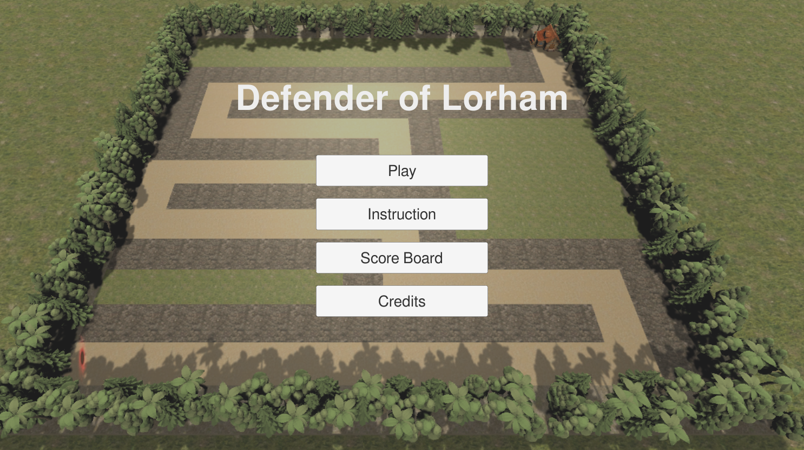

# First Person Tower Defense

By **Ziqiang Guan** and **William Goss**

Unity Version: **2017.4.36f1**

This repository contains final project for CMPSCI590G Game Programming at University of Massachuetts, Amherst and is hosted on [GitHub](https://github.com/treble-maker123/game-final).

All scripts in `Assets/Scripts` are written by us, all gun prefabs come from [DevAssets](devassets.com), all audio clips are from [FreeSound](freesound.org), and all other prefabs come from the Unity Asset Store.

## Game Description

As a brave hunter and tinkerer of Lorham, whose residents have been terrorized by the monsters and orcs spawning from a demonic portal that recently appeared outside of the village, you have decided to taken up arms and put your skills to use in defending the village. With your collection of guns and your talent for tinkering with mechanical contraptions, will you be able to protect the villagers of Lorham and drive the monsters back to the demonic realm?

For additional information, see the in-game tutorial.

### Points

Points for the game are calculated by a combination of the difficulty you selected, the number of mobs you have managed to kill at each difficulty, the final level you reach, and the amount of gold you have left at the end of the game. 

### Difficulty

The game has three difficulty settings - easy, medium, and hard. The difficulty settings not only impacts the length of the path generated (i.e. higher the difficulty, the shorter the path the monsters have to walk to reach its destination), they will also affect the amount of gold you get with each kill (i.e. higher the difficulty, the less gold you get for each kill), the scaling factor for the health of each monster at each level (i.e. higher the difficulty, the more health the monsters get at each level), as well as the number of points you are rewarded for your game. 

### Guns

You have a choice of three weapons at your disposal that you can swap between anytime during the game, a rifile (**The Evangelos**), a pistol (**The Aeril Snapshot**), and a heavy gun (**Slowing MG-120**), each with its unique characteristics. The rifle can file rapidly in sucession, but has a high degree of inaccuracy and does small amount of damage. The pistol can only be fired one shot at a time, but is highly accurate. And lastly, the heavy gun does not deal much damage, but can slow down an enemy's advancing speed.

### Towers

You are able to build three types of towers to help you drive back the advancement of monters. Similar to your guns, the towers you are able to build have distinct abilities as well and can be upgraded as you earn more gold from defending your village. The **Wall-(E)Xterminator** tower targets ground units with absolute ruthlessness, the **SkyWatch v2** is specialized tower targeting air units, and last but not least, if the mobs are overwhelming you, try putting down a **Slowmo Probe** to give yourself some breathing room. 
